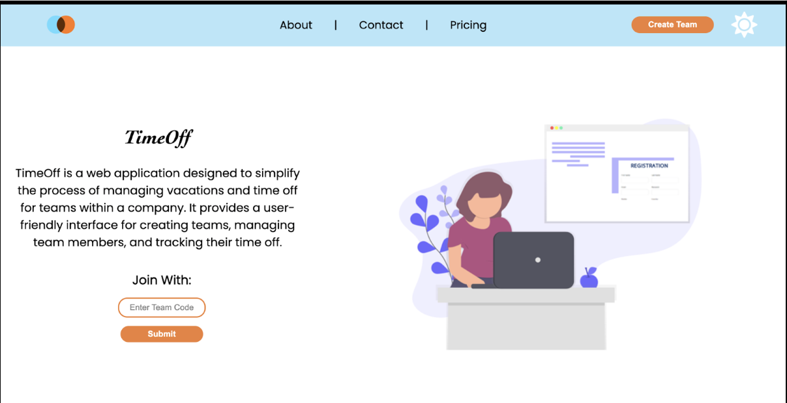
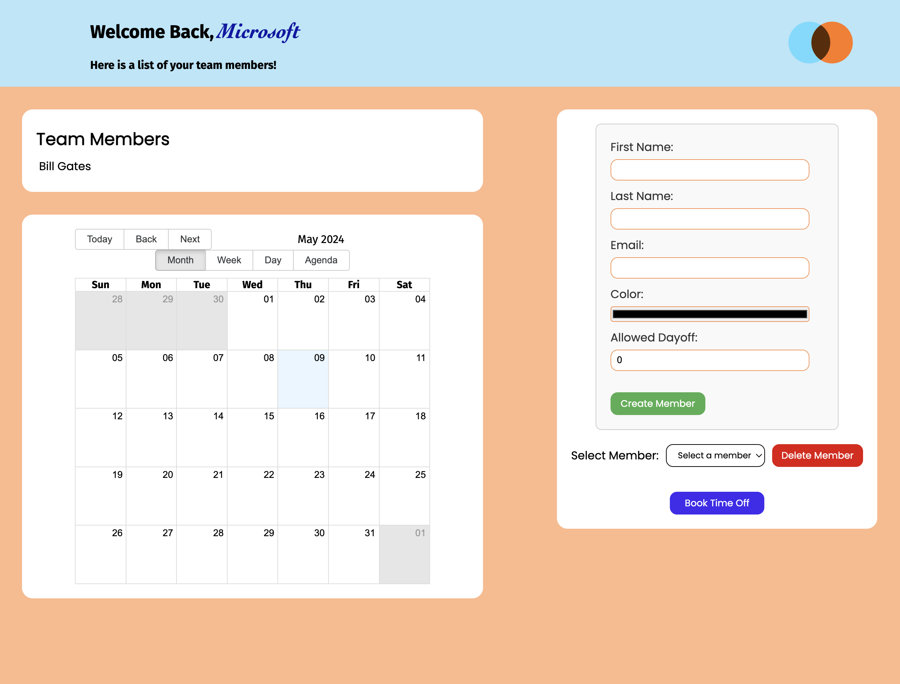
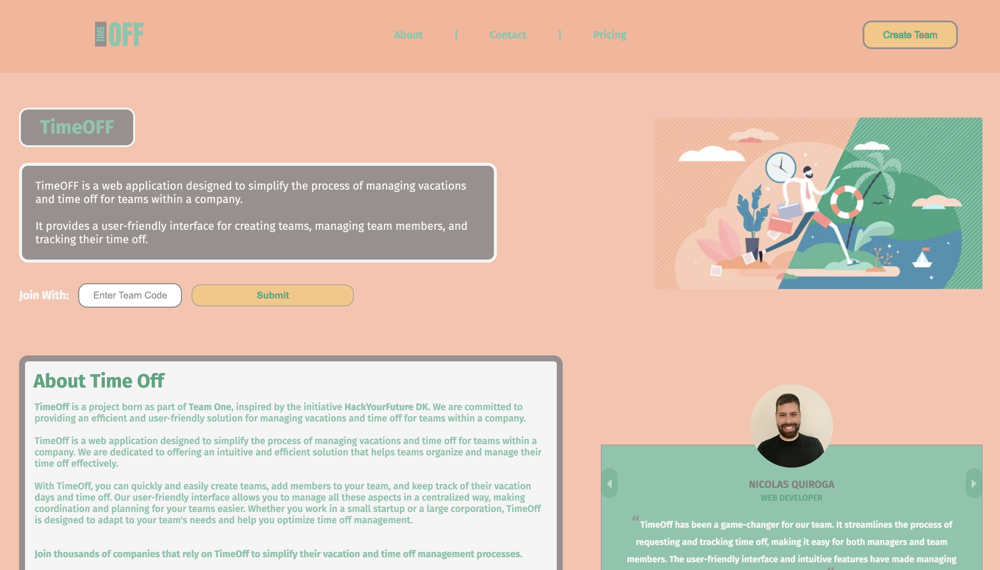

# TimeOFF App

TimeOff originated as the final project during my participation in HackYourFuture, where we were tasked with implementing a set of functionalities for the application as part of a team project. Inspired by the initiative of HackYourFuture DK, TimeOff_App is a web-based solution aimed at streamlining the management of vacations and time off for teams within organizations. 

Following the completion and presentation of the initial version, I took the initiative to fork the original project. 

# Goal
My goal was to refactor the application, introducing a fresh design and enhancing its functionality to serve as a solid foundation for a more robust and stylized application.

## Development Status

Currently, TimeOff_App is in an advanced stage of development. The following functions are operational:

### Index Page:
- **Team Authentication:** Utilizing a unique code per team, team validation is enabled to grant access to the main functionalities of the app.
  
- **Team Creation:** Easily create a new team through the header button on the index page. Clicking on it generates a new validation key.

- The index page also features a carousel of testimonials, an app overview section, and a pricing section.

Upon accessing the dashboard using the team code, the following functions are available:

### Dashboard:
- **Team Member Visualization**
- **Calendar:** Displays assigned time off for team members, identified with previously chosen colors during member creation.
  
- **Member Creation:** Fill out a form to create a new team member, assigning a color and the number of days off for that member.
  
- **Member Deletion:** Delete a selected member from the team via a dropdown menu. Confirmation is required before deletion.
  
- **Add Time Off:** Add a new entry to the calendar, specifying start and end dates of the event, along with a reason.
  
- **Delete Time Off:** Remove an event from the calendar.

### Additional App Information:

- Data is hosted on an external server, and data updates are generated on the database.

## Getting Started

To start using the app:

1. Install the dependencies with:

npm install 

2. Run the backend and frontend  using:

npm run start

## Deployment

A deployed version is available at the following link: [TimeOFF App Deployment](https://time-off-nu.vercel.app/)

## Original version:

[Original Repo](https://github.com/HackYourFuture-CPH/team26-TimeOff_App)

## New version:

## Contributing

Contributions to TimeOff_App are welcome! If you have any ideas for improvements, new features, or bug fixes, feel free to submit a pull request or open an issue on the GitHub repository.
